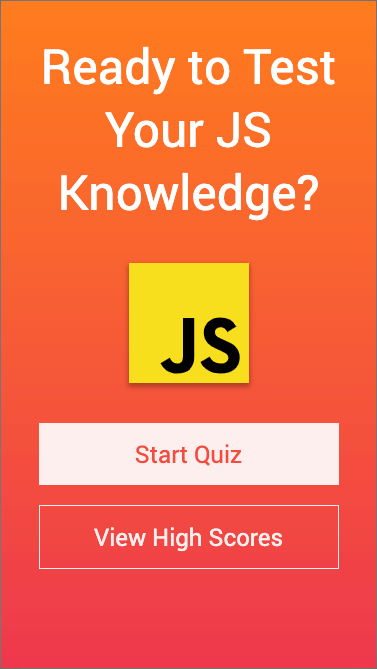
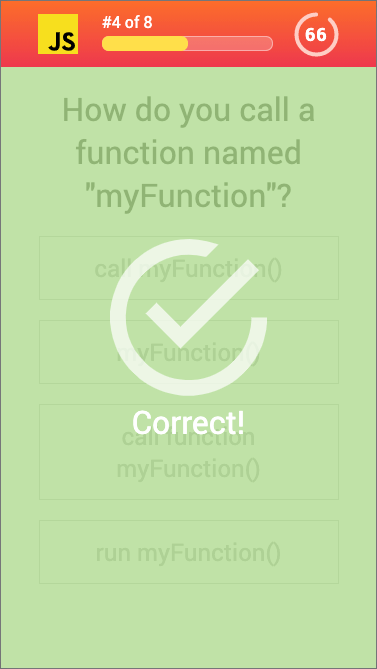

# javascript-quiz

This is a quick quiz to test your understanding of beginner JavaScript concepts. Features include:

1. Responsive, mobile first design
1. Visual timer and progress bar
1. Leaderboard that uses local storage to remember previous scores
1. Leaderboard sorts itself to display the highest scores first

## Link

https://rjwrightme.github.io/javascript-quiz/

## Screenshot

The following images demonstrate the application functionality:

